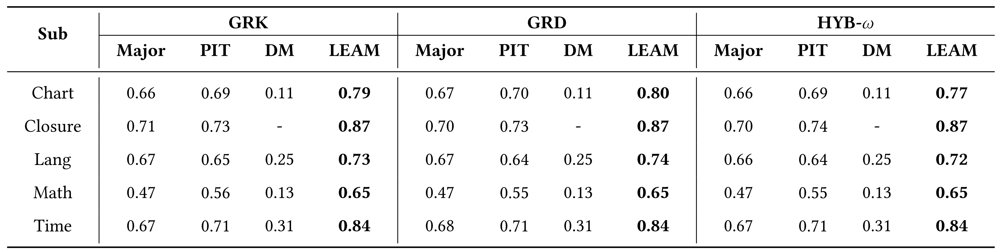
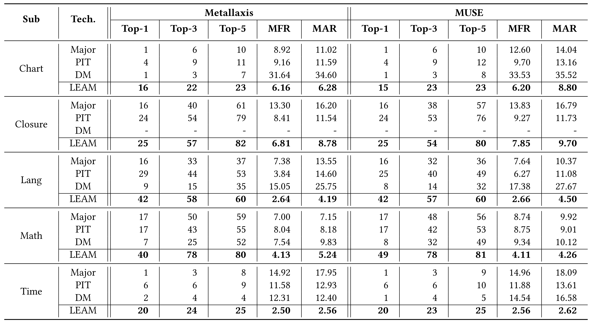

# LEAM

## Environment
* Python 3.7
* PyTorch 1.3
* Defects4J V1.0
* Java 8

## A Demo

We provide a demo to generate mutation faults for Defects4J V1.0. 

### Generate Mutation Faults for Defects4J V1.0 (Fixed Version)

Please run `CUDA_VISIBLE_DEVICES=0,1 python3 testDefect4jV1Fixed.py Chart-1` in the `LEAM/` folder directory. The generated mutation faults are saved as JSON in the `LEAM/mutants/` folder directory.

1. `CUDA_VISIBLE_DEVICES=0,1`: specify two available GPUs.
2. `Chart-1`:  a specific project ( JFree Chart, 1, fixed version).

## Experimental Results

####  1. Distribution of real faults by the number of involved statements

--- --- ---

#### 2. Ability of representing real faults interms of adequate test suites. (a) shows the result when using all the constructed mutation faults; (b)/(c) shows the result under controlling for the number of mutation faults when considering/ignoring DeepMutation (DM)

--- ---

#### 3. Ability of representing mutation faults constructed by other mutation techniques. (a) shows the result when using all the constructed mutation faults; (b)/(c) shows the result under controlling for the number of mutation faults when considering/ignoring DeepMutation (DM)

--- ---

#### 4. Correlation between mutation score and real fault detection

--- ---

#### 5. Effectiveness comparison in mutation-based TCP (Chart, Closure, Lang, Math, Time)

--- ---

#### 6. Effectiveness comparison in mutation-based FL (Chart, Closure, Lang, Math, Time)

--- ---

#### 7. Ablation test for LEAM on mutation-based TCP (Chart, Lang, Math, Time)

--- ---

#### 8. Ablation test for LEAM on mutation-based FL (Chart, Lang, Math, Time)

--- ---

#### 9.  The influence of the number of mutation faults, which can be controlled by beam size, on mutation-based TCP (Chart)

--- ---

#### 10.  The influence of the number of mutation faults, which can be controlled by beam size, on mutation-based FL (Chart)

--- ---
