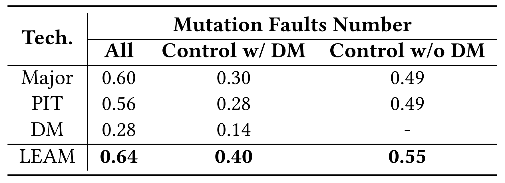
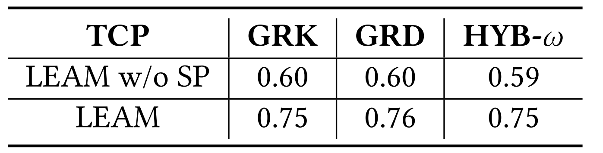

# LEAM

## 1. Environment
* Python 3.7
* PyTorch 1.3
* Defects4J V1.0
* Java 8

## 2. A Demo

Pleas find our built model at: <https://huggingface.co/anonymoussss/leam/blob/main/best_model.ckpt>. Download the model and place it in folder `LEAM/checkpointSearch/`.

We provide a demo to generate mutation faults for JFree Chart on fiexd version.

Please run `CUDA_VISIBLE_DEVICES=0,1 python3 testDefect4jV1Fixed.py Chart-1` in the `LEAM/` folder directory. The generated mutation faults are saved as JSON in the `LEAM/mutants/` folder directory.

(1) `CUDA_VISIBLE_DEVICES=0,1`: specify two available GPUs.
(2) `Chart-1`: `project name` and `bug id`.

## 3. Experimental Results

####  (1) Distribution of real faults by the number of involved statements

--- --- ---

#### (2) Ability of representing real faults interms of adequate test suites. (a) shows the result when using all the constructed mutation faults; (b)/(c) shows the result under controlling for the number of mutation faults when considering/ignoring DeepMutation (DM)

--- ---

#### (3) Ability of representing mutation faults constructed by other mutation techniques. (a) shows the result when using all the constructed mutation faults; (b)/(c) shows the result under controlling for the number of mutation faults when considering/ignoring DeepMutation (DM)

--- ---

#### (4) Correlation between mutation score and real fault detection

--- ---

#### (5) Effectiveness comparison in mutation-based TCP when considering/ignoring Closure

 

--- ---

#### (6) Effectiveness comparison in mutation-based FL when considering/ignoring Closure

 

--- ---

#### (7) Ablation test for LEAM on mutation-based TCP (Chart, Lang, Math, Time)

--- ---

#### (8) Ablation test for LEAM on mutation-based FL (Chart, Lang, Math, Time)

--- ---

#### (9) The influence of the number of mutation faults, which can be controlled by beam size, on mutation-based TCP (Chart)

--- ---

#### (10) The influence of the number of mutation faults, which can be controlled by beam size, on mutation-based FL (Chart)

--- ---
