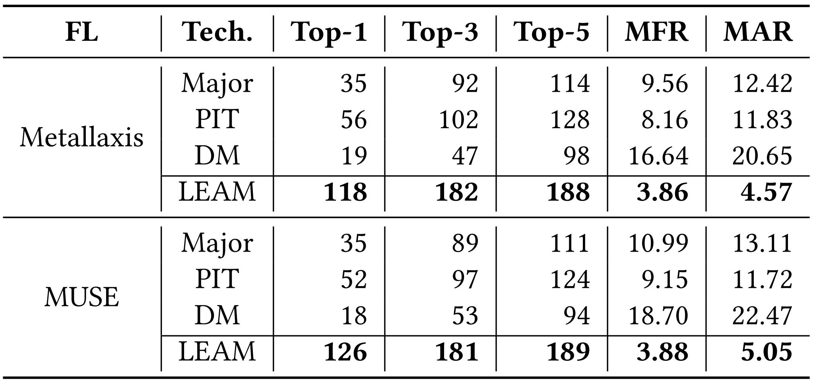
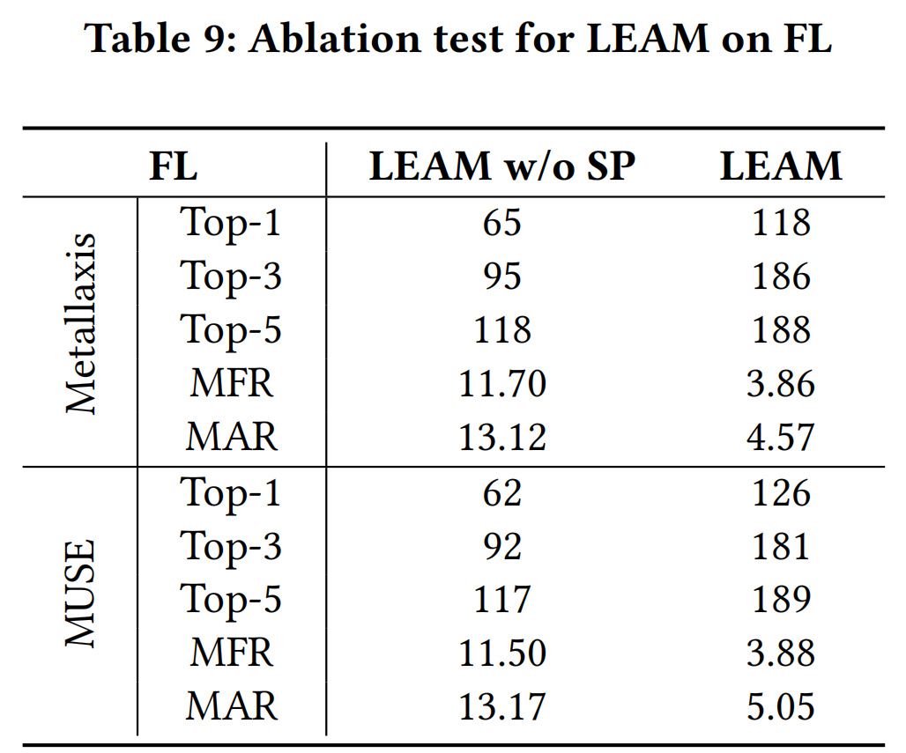

# LEAM

LEAM adapts the syntax-guided encoder-decoder architecture by extending a set of grammar rules specific to our mutation task, to guarantee syntactic correctness of constructed mutation faults. It predicts the statements to be mutated under the context of the targeted method to reduce search space, and then predicts grammar rules for mutation fault construction based on both semantic and structural features in AST.

See [Zhao Tian](https://tianzhaotju.github.io/), [Junjie Chen](https://sites.google.com/site/junjiechen08/), et al. "[Learning to Construct Better Mutation Faults](./LEAM.pdf)." The 37th IEEE/ACM International Conference on Automated Software Engineering (ASE'22).

 🏆 ACM SIGSOFT Distinguished Paper Award 

## 1. Environment

* Python 3.7
* PyTorch 1.3
* Defects4J V1.0
* Java 8


## 2. A Demo

Pleas find our built model at [this link](https://huggingface.co/anonymoussss/leam/blob/main/best_model.ckpt). Download the model and place it in folder `LEAM/checkpointSearch/`.
(If you need, you can download the raw data from [this link](https://drive.google.com/drive/folders/1ECNX98qj9FMdRT2MXOUY6aQ6-sNT0b_a?usp=sharing).)
We provide a demo to generate mutation faults for JFree Chart on fiexd version.

Please run `CUDA_VISIBLE_DEVICES=0,1 python3 testDefect4jV1Fixed.py Chart-1` in the `LEAM/` folder directory. The generated mutation faults are saved as JSON in the `LEAM/mutants/` folder directory.

(1) `CUDA_VISIBLE_DEVICES=0,1`: specify two available GPUs.
(2) `Chart-1`: `project name` and `bug id`.


## 3. Experiment Configuration
#### (1) LEAM: The corresponding location files are provided under the `location2/` folder, which can help LEAM locate the function that needs to be mutated. You can easily follow the given example to design the location files for your mutated files. And you can use the default settings for the other hyper-parameters.
#### (2) [Major](http://mutation-testing.org/): --DmutOp=tutorial.mml
```angular2html
tutorial.mml

targetOp{
    // Define the replacements for ROR
    BIN(>)->{>=,!=,FALSE};
    BIN(<)->{<=,!=,FALSE};
    BIN(>=)->{>,==,TRUE};
    BIN(<=)->{<,==,TRUE};
    BIN(==)->{<=,>=,FALSE,LHS,RHS};
    BIN(!=)->{<,>,TRUE,LHS,RHS};
    // Define the replacements for COR
    BIN(&&)->{==,LHS,RHS,FALSE};
    BIN(||)->{!=,LHS,RHS,TRUE};
    // Define the type of statement that STD should delete
    DEL(RETURN);

    // Enable the STD, COR, and ROR mutation operators
    STD;
    COR;
    ROR;
}
// Call the defined operator group for the target method
targetOp<"triangle.Triangle::classify(int,int,int)">;
```
#### (3) [PITest](https://pitest.org/): Version==1.7.4, --mutators=`<mutators><mutator>ALL</mutator></mutators>`

## 4. Experimental Results

####  (1) Distribution of real faults by the number of involved statements


--- --- ---


#### (2) Ability of representing real faults interms of adequate test suites. (a) shows the result when using all the constructed mutation faults; (b)/(c) shows the result under controlling for the number of mutation faults when considering/ignoring DeepMutation (DM)


--- ---


#### (3) Ability of representing mutation faults constructed by other mutation techniques. (a) shows the result when using all the constructed mutation faults; (b)/(c) shows the result under controlling for the number of mutation faults when considering/ignoring DeepMutation (DM)


--- ---


#### (4) Correlation between mutation score and real fault detection


--- ---


#### (5) Effectiveness comparison in mutation-based TCP when ignoring/considering Closure (detailed experimental data can be found in the `experiment/tcp.csv` folder)
<center> <div><b>(a) Ignoring Closure</b><div/>

<center/>
<br>
<center> <div><b>(b) Considering Closure<b/><div/>

<center/>


--- ---


#### (6) Effectiveness comparison in mutation-based FL when ignoring/considering Closure  (detailed experimental data can be found in the `experiment/fl.csv` folder)
<center> <div><b>(a) Ignoring Closure<b/><div/>

<center/>
<br>
<center> <div><b>(b) Considering Closure<b/><div/>

<center/>


--- ---


#### (7) Comparison effectiveness between LEAM and its variant w/o statement prediction (SP) in mutation-based TCP (Chart, Lang, Math, Time)


--- ---


#### (8) Comparison effectiveness between LEAM and its variant w/o statement prediction (SP) in mutation-based FL (Chart, Lang, Math, Time)


--- ---


#### (9) The influence of the number of mutation faults, which can be controlled by beam size, on mutation-based TCP (Chart)


--- ---


#### (10) The influence of the number of mutation faults, which can be controlled by beam size, on mutation-based FL (Chart)


--- ---

## 4. Acknowledgement

We are very grateful that the authors of TreeGen and Recoder make their code publicly available so that we can build this repository on top of their code.

This work was partially supported by the National Natural Science Foundation of China Grant No. 62002256, and National Science Foundation under Grant Nos. CCF-2131943 and CCF-2141474.

Feel free to contact Zhao Tian (tianzhao[AT]tju[DOT]edu[DOT]cn) and Junjie Chen (junjiechen[AT]tju[DOT]edu[DOT]cn) if you have any further questions.
